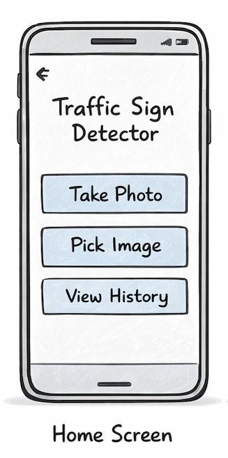

## Title

Pick an image from the gallery

## Value proposition

As a user
I want to select an image from the gallery
So that I can analyze an existing road image

## Description

- User taps the "Pick Image" button
- The gallery opens
- The selected image is passed to the image review screen

## Acceptance criteria

- [ ] When gallery permission is denied, a clear alert is shown
- [ ] Tapping "Pick Image" opens the gallery
- [ ] The user can select exactly one image
- [ ] After selecting an image, the app navigates to the image review screen
- [ ] Alert text for denied permission: "Gallery access is required to choose an image."

## Tasks

- [ ] Add the Pick Image button on HomeScreen
- [ ] Request gallery permission
- [ ] Implement gallery picker logic
- [ ] Store the selected image URI
- [ ] Navigate to ImageReviewScreen with the image URI
- [ ] Add alert handling for denied permission