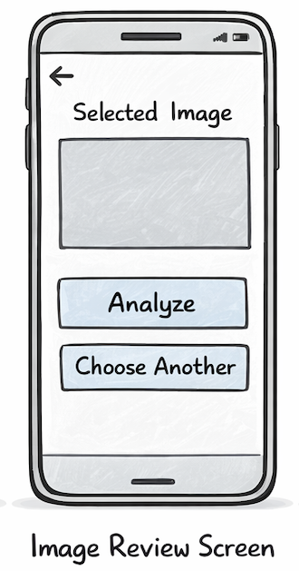

## Title

Review the selected image before analysis

## Value proposition

As a user
I want to preview the selected image
So that I can confirm that I selected the correct photo

## Description

- The selected image is displayed
- The user can either analyze the image or choose another image

## Acceptance criteria

- [ ] When no image URI exists, the screen shows a fallback message
- [ ] The selected image is visible without distortion
- [ ] The "Analyze Image" button is visible
- [ ] The "Choose Another Image" button is visible
- [ ] Fallback text when image is missing: "No image selected."

## Tasks

- [ ] Create ImageReviewScreen
- [ ] Read the image URI from navigation parameters
- [ ] Render the image preview
- [ ] Add the Analyze Image button
- [ ] Add the Choose Another Image button
- [ ] Add fallback UI for missing image data