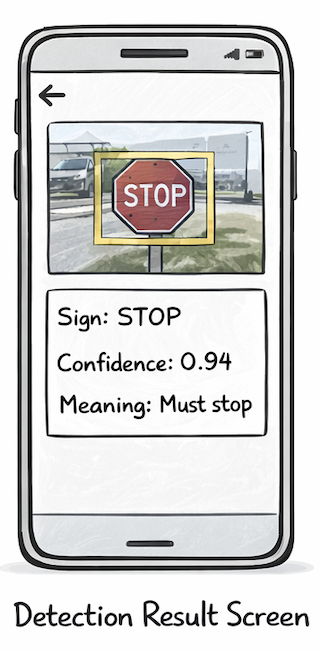

## Title

Show the detection result with bounding boxes

## Value proposition

As a user
I want to see the detected traffic signs on the image
So that I understand what the system found

## Description

- The analyzed image is displayed
- Bounding boxes are drawn on top of the image
- The result card shows sign name, confidence and meaning

## Acceptance criteria

- [ ] When the detection list is empty, a "No traffic sign detected" message is shown
- [ ] Bounding boxes are rendered in the correct positions
- [ ] Multiple detections can be displayed
- [ ] The result card shows label, confidence and meaning
- [ ] Empty state text: "No traffic sign detected."

## Tasks

- [ ] Create DetectionResultScreen
- [ ] Render the analyzed image
- [ ] Create the BoundingBoxOverlay component
- [ ] Convert backend coordinates to displayed image coordinates
- [ ] Render labels near each bounding box
- [ ] Create the DetectionResultCard component
- [ ] Map labels to local sign information
- [ ] Add empty-state UI