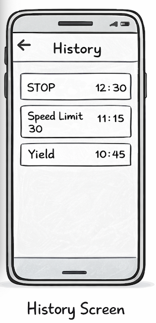

## Title

Save a detection result to history

## Value proposition

As a user
I want my detection results to be saved
So that I can review them later

## Description

- After a successful analysis, the result is stored locally
- The history screen shows previous detections

## Acceptance criteria

- [ ] When no history entries exist, the history screen shows an empty state
- [ ] A successful detection is stored locally
- [ ] The stored entry contains image URI, label, confidence and timestamp
- [ ] Stored history remains available after app restart
- [ ] Empty state text: "No detections yet."

## Tasks

- [ ] Install AsyncStorage
- [ ] Create the HistoryService
- [ ] Define the stored history item model
- [ ] Save detection data after successful analysis
- [ ] Create HistoryScreen
- [ ] Load stored entries on screen open
- [ ] Sort entries by newest first
- [ ] Add empty-state UI for no saved results